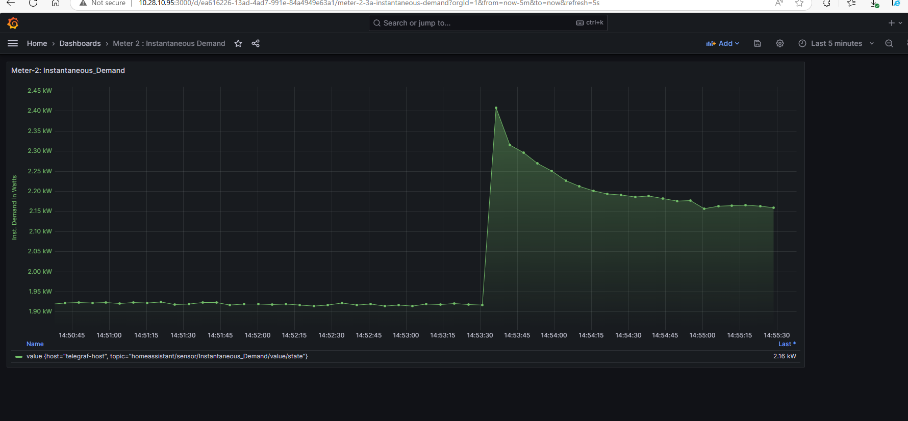
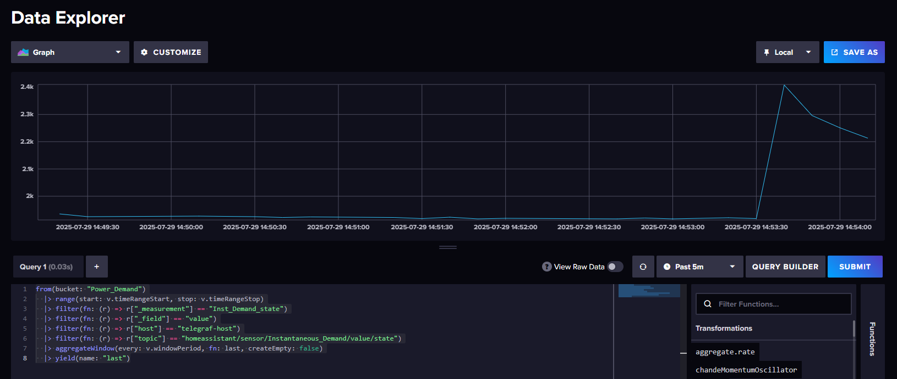

---

# Automated Real-Time Itron Smart Meter Monitoring

This repository provides a fully automated, containerized solution for real-time monitoring of Xcel Energy Itron smart meters using **MQTT**, **InfluxDB**, and **Grafana**.

It extends the original [xcel_itron2mqtt](https://github.com/zaknye/xcel_itron2mqtt) project by adding new features and streamlined automation.

## ✨ New Features

| Feature                       | Description                                                                                         |
| ----------------------------- | --------------------------------------------------------------------------------------------------- |
| **MQTT Data Ingestion**       | Reads smart meter data from an MQTT broker using a Telegraf listener.                               |
| **InfluxDB Integration**      | Stores readings in a time-series database (InfluxDB) for efficient querying and analysis.           |
| **Grafana Dashboards**        | Auto-configured dashboards for real-time data visualization (updates every 5 seconds).              |
| **Multi-Meter Support**       | Supports monitoring of one or multiple physical smart meters.                                       |
| **Simulator Support**         | Easily test and validate the pipeline using a built-in smart meter simulator.                       |
| **Dockerized Deployment**     | All components (MQTT, Telegraf, InfluxDB, Grafana) are containerized using Docker for easy setup.   |
| **Environment Configuration** | Centralized `.env` file for managing MQTT, database, and Grafana credentials.                       |
| **Makefile Automation**       | Simplifies common tasks like setup, startup, and teardown using `make` commands and bash scripting. |

## Architecture

#### Grafana Dashbaord

  

  

   

#### InfluxDB

 

## Getting Started

To use a specific setup:

- **Simulator**: switch to the `feature/meter-simulator` branch
- **Single Real Meter**: switch to `feature/han-single-meter`
- **Two Real Meters**: switch to `feature/han-two-meters`
