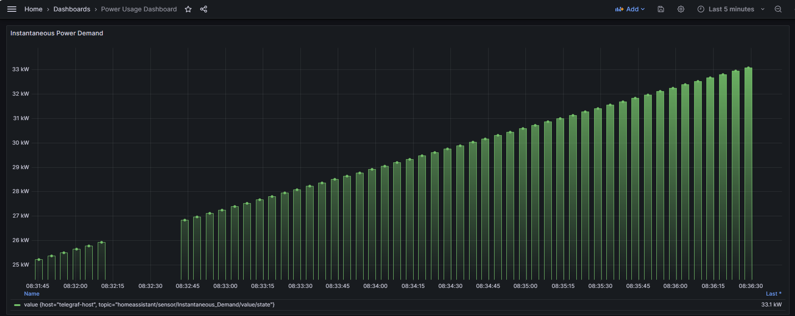

## Itron2Grafana  -  Xcel Itron Meter Monitoring using fully automated realtime dashboard 

[](https://github.com/your-repo/I2M2G)
[](https://github.com/your-repo/I2M2G)


This application connects to a smart meter simulator agent running in Energy Launchpad. The `meter2mqtt` service queries the simulator every 5 seconds to collect power usage data, which is then published to MQTT for real-time visualization in Grafana.

## Architecture 

 

### Grafana Dashbaord
  


## Quick Start

**Step 1: Clone Required Repositories**

```bash
# Clone this I2M2G repository
git clone -b <branch-name> --single-branch <URL>

# Clone Energy Launchpad repository (for simulator)
git clone <energy launchpad repo url>
```

**Step 2: Start the Meter Simulator**

```bash
# Navigate to launchpad directory
cd launchpad

# Start the simulator
docker compose up
```

**Step 3: Start I2M2G Stack**

```bash
# Navigate back to I2M2G directory
cd ../I2M2G
```

```bash

# Setup and start everything (detects OS automatically)
make setup
```

```bash
# Automatically connect InfluxDB to Grafana and create power usage dashboard
make connect-grafana
```
> `make connect-grafana` will automatically connect InfluxDB to Grafana, setting up the data source with proper authentication, creates a customized Power Usage Dashboard with real-time visualization. 

#### Access Dashboards: 
>- **Grafana**: http://YOUR_HOST_IP:3000 (admin/admin)
>- **InfluxDB**: http://YOUR_HOST_IP:8086 (admin/adminpassword)


```bash
# Pause/Resume (preserves all data)
# Pause services 
make pause

# Resume services later
make resume
```

  > When services are paused, Grafana will show no data points for the time period when no data was being collected.


**Step 4: Cleanup**


**Complete Cleanup (deletes data and starts):**
```bash
# Stop I2M2G and clean everything
make clean

# Stop simulator (run inside launchpad dir)
cd ../launchpad
docker compose down -vv
```


## Help

```bash
# Show all available commands
make help
```

## Note :


  > - Check if simulator is working at: `http://<HOST_IP>:8082/swagger/index.html`
  > - Find SIMULATOR_IP, username and passwords in .env file for both InfluxDB & Grafana

