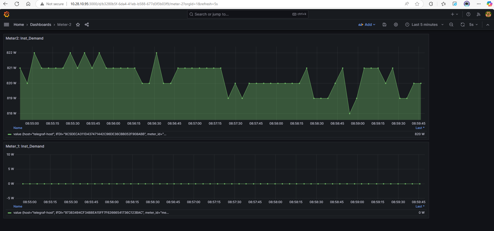
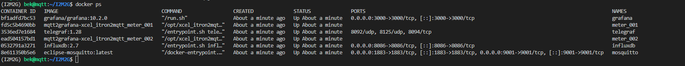

## I2M2G v3.0 :  Support 2 meters

> This branch has a working configuration for working with two smart meters. The two meters run in separate containers and will send data to common MQTT broker in separate topics.  

### Grafana visual for two meters:

 

#### Docker ps
  

## Quick start for Real Meter 

1.  clone the repo
2.  Copy certs in mqtt2grafana folder

    > VERY IMPORTNAT : Add SSL keys in mqtt2grafana directory before doing anything. See the file structure below:

    

3.  cd `mqtt2grafana` && `./start_real_meter_linux.sh`

4.  Login to InfluxDB at http://localhost:8086 & to Grafana at http://localhost:8086
5.  connect grafana with InfluxDB [(follow instruction here )](/mqtt2grafana/docs/connect_influxdb_2_grafana.md)
6.  stop container and delete everything run `./remove_real_meter.sh`

