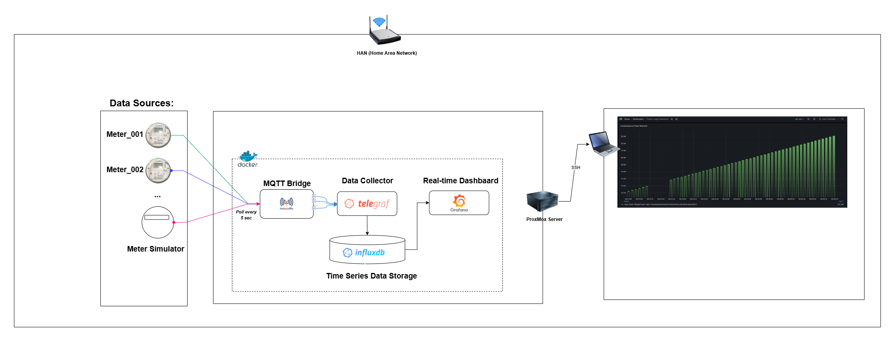
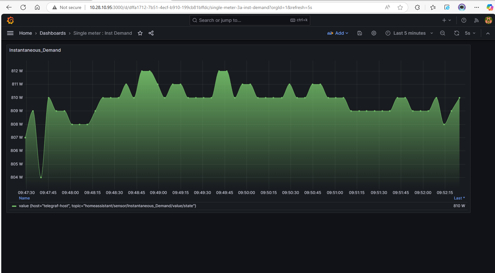
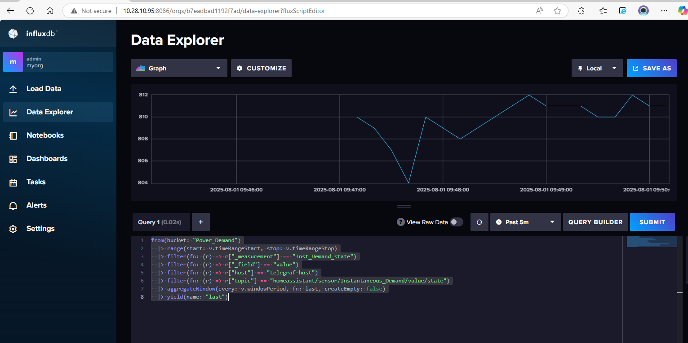
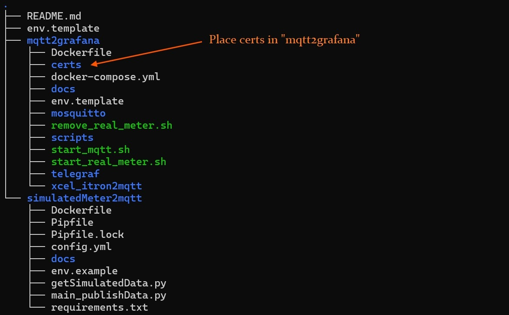

---

## Automated Real-time Itron Smart Meter Monitoring

[](https://github.com/your-repo/I2M2G)
[](https://github.com/your-repo/I2M2G)

This branch supports integrating data from a single Itron smart meter. The configuration is setup in `docker-compose.yml` file in the `mqtt2grafana` directory.

## Architecture



#### Grafana Dashboard



#### InfluxDB



## Quick start

**Step 1: Clone Repository and add SSL Cert**

```bash
# clone repo
git clone -b feature/han-single-meter --single-branch <URL>

# enter mqtt2grafana directory
cd I2M2G/mqtt2grafana
```

> VERY IMPORTNAT : Add SSL keys in mqtt2grafana directory before doing anything. See the file structure below:



**Generate or check SSL Keys:**

```bash
# Check if SSL keys exist
make check-keys

# Generate SSL keys for meter authentication
make generate-keys
```

**Step 2: Setup and Start Real Meter Stack**

```bash
# Setup environment and start everything
make setup
```

```bash
# Automatically connect InfluxDB to Grafana and create power usage dashboard
make connect-grafana
```

> `make connect-grafana` will automatically connect grafana with influxdb and cusomize the dashbaord.

**Access Dashboards**

After running `make setup`, the script will display the service endpoints using your meter IP:

- **Grafana**: http://YOUR_METER_IP:3000 (admin/admin)
- **InfluxDB**: http://YOUR_METER_IP:8086 (admin/adminpassword)

**Step 3: Pause/Resume or Cleanup**

```bash
# Pause services (preserves data)
make pause

# Resume services
make resume

# Complete cleanup (removes all data)
make clean
```

## Help

```bash
# Show all available commands
make help
```

**Note:** When services are paused, Grafana will show zero values for the time period when no data was being collected.

## <!-- ---

--- -->

<!-- ### 📋 Manual Workflow (Legacy)

1.  clone this branch

    ```
    # git clone -b <branch-name> --single-branch <URL>

    git clone -b feature/han-single-meter --single-branch <URL>
    ```

2.  Copy certs in mqtt2grafana folder

    > VERY IMPORTNAT : Add SSL keys in mqtt2grafana directory before doing anything. See the file structure below:

    

3.  cd `mqtt2grafana` && `./start_real_meter_linux.sh`

4.  Login to InfluxDB at http://localhost:8086 & to Grafana at http://localhost:8086
5.  Manually connect grafana with InfluxDB [(follow instruction here )](/mqtt2grafana/docs/connect_influxdb_2_grafana.md)
6.  stop container and delete everything run `./remove_real_meter.sh` -->
