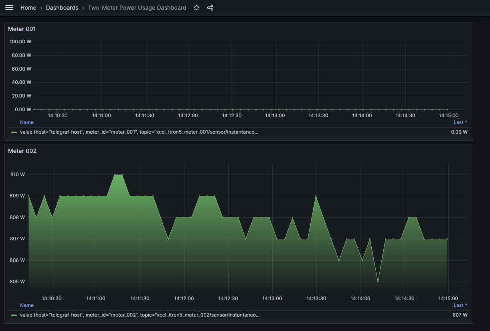

## Itron2Grafana  -  Xcel Itron Meter Monitoring using fully automated realtime dashboard 

[](https://github.com/your-repo/I2M2G)
[](https://github.com/your-repo/I2M2G)

This is a branch supports integrating data from two Itron smart meters. The two meters are described as `meter_001` and `meter_002` in `docker-compose.yml` file


## Architecture
 


### Grafana Dashboard ( 2 meters)
 

 > Grafana Dashboard with 2 panels (2 meters)


## Quick start for 2 Meters

**Step 1: Clone Repository**

```bash

# clone repo /branch
git clone -b feature/han-two-meters --single-branch <git url>

# enter mqtt2grafana directory
cd I2M2G/mqtt2grafana
```


> VERY IMPORTNAT : Add SSL keys in mqtt2grafana directory before doing anything. See the file structure below:

 

**Generate or check SSL Keys:**

```bash
# Check if SSL keys exist
make check-keys

# Generate SSL keys for meter authentication
make generate-keys
```


**Step 2: Setup and Start Two-Meter Stack**

```bash
# Setup environment and start everything
make setup
```

```bash
# Automatically connect InfluxDB to Grafana and create two-meter dashboard
make connect-grafana
```

> `make connect-grafana` will automatically connect grafana with influxDB and will create a real-time dashbaord with separate panels for each meter: `meter_001` and `meter_002`.


**Access Dashboards**

After running `make setup`, the script will display the service endpoints using your meter IP:

- **Grafana**: http://YOUR_METER_IP:3000 (admin/admin)
- **InfluxDB**: http://YOUR_METER_IP:8086 (admin/adminpassword)

**Step 3: Pause/Resume or Cleanup**
```bash
# Pause services (preserves data)
make pause

# Resume services
make resume


# Complete cleanup (removes all data)
make clean
```


**Note:** When services are paused, Grafana will show zero values for the time period when no data was being collected.


### Tips

- Find username and passwords in .env file for both InfluxDB & Grafana
- Inside InfluxDB, Use `query Builder` feature to generate Flux queries and use the query to build a dashborad in grafana.


- To change MQTT topic:
    - Upadte the `env.template` file's `"MQTT_TOPIC_PREFIX"` under `"MQTT Configuration"`
    - Upadte `telegraph.conf` with MQTT topics 

- Update `.yaml` files under `xcel_itron2mqtt>configs` to configure meter end_points 


### Help

```bash
# Show all available commands
make help
```


<!-- ### 📋 Manual Workflow (Legacy)

1.  clone this branch:

    ```
    git clone -b feature/han-two-meters --single-branch <git url>
    ```

2.  Copy certs in mqtt2grafana folder

    > VERY IMPORTNAT : Add SSL keys in mqtt2grafana directory before doing anything. See the file structure below:

    

3.  cd `mqtt2grafana` && `./start_real_meter_linux.sh`

4.  Login to InfluxDB at http://localhost:8086 & to Grafana at http://localhost:8086
5.  connect grafana with InfluxDB [(follow instruction here )](/mqtt2grafana/docs/connect_influxdb_2_grafana.md)
6.  stop container and delete everything run `./remove_real_meter.sh` -->


