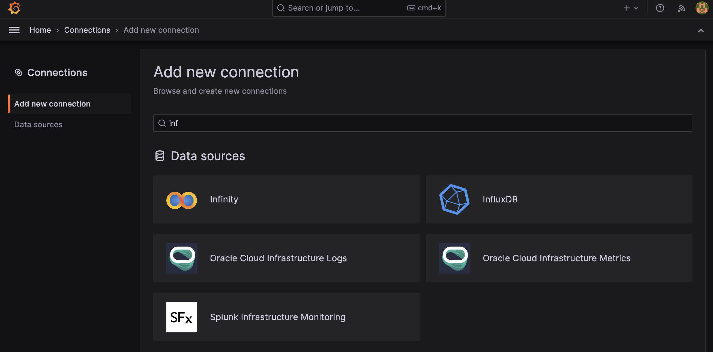
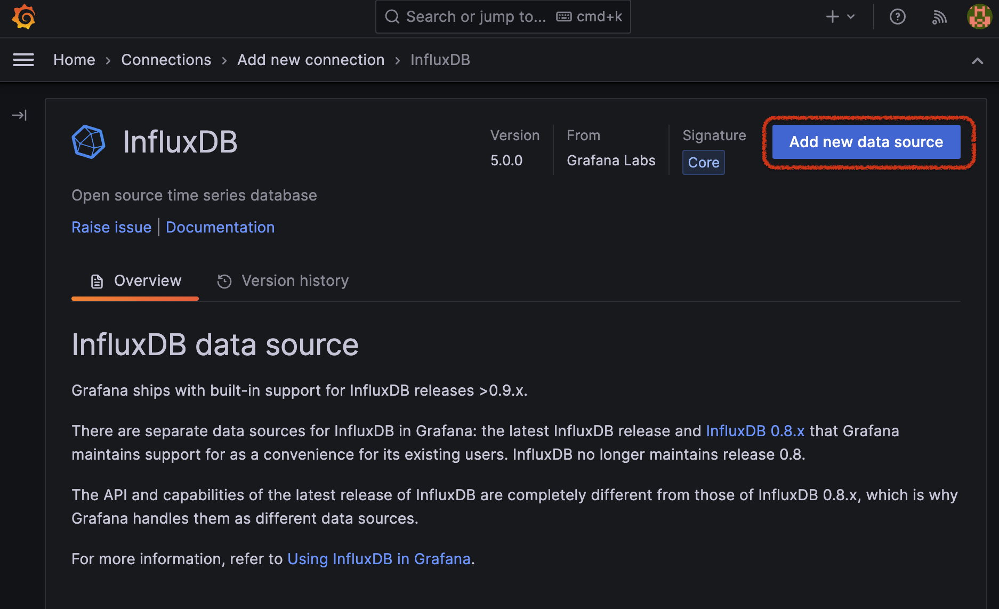
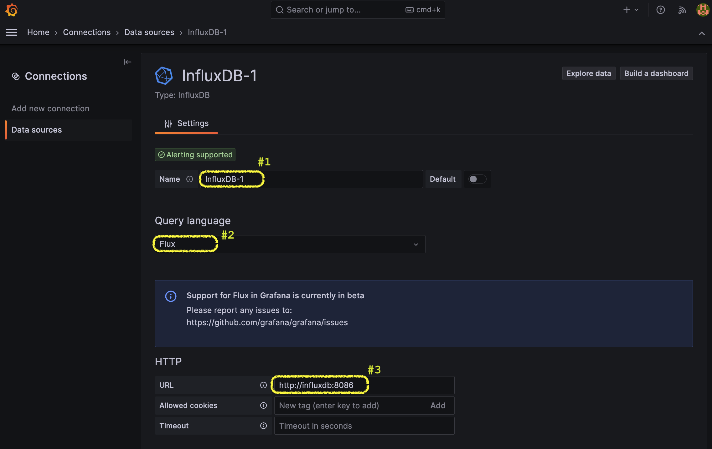
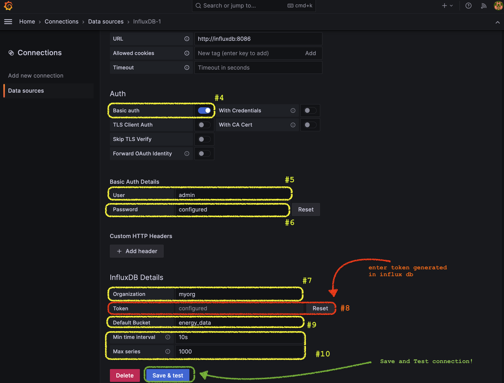
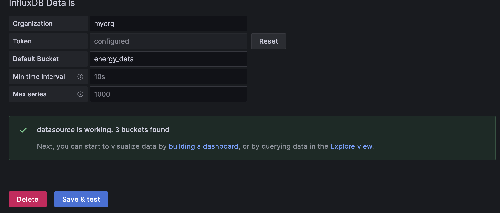
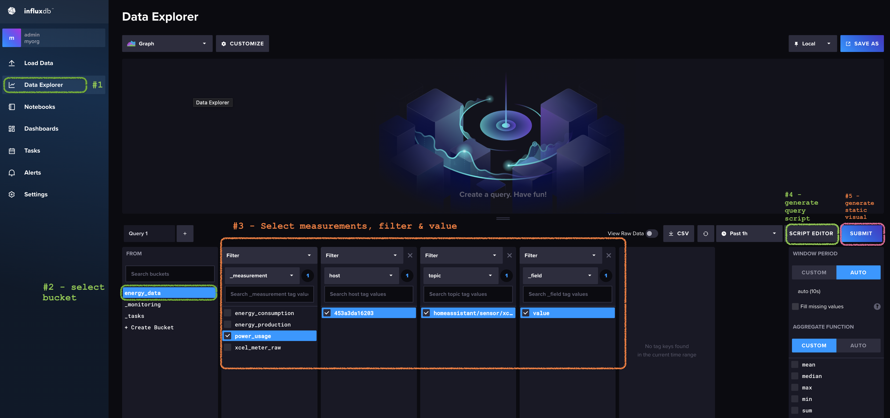
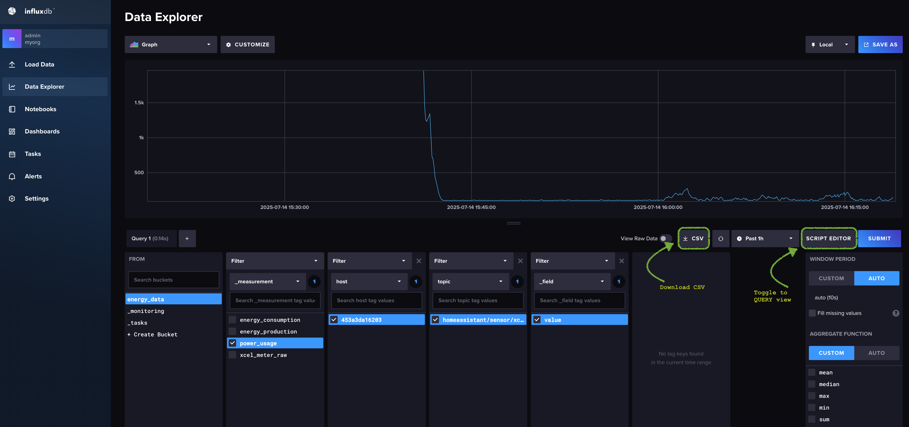

## Connect Grafana to InfluxDB

1. Open grafana at http://localhost:3000 and then go to Menu > Add new Connection > search for InfluxDB

   
   

2. Enter configurations

   > **Note**: Look at `Docker-compose.yml` & `.env` to copy some of configuration details.

   > [How to get API token](/mqtt2grafana/docs/api_token.md)

   
   
   

3. Query Builder

   
   
